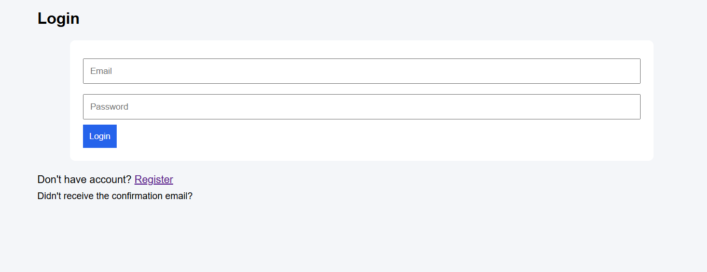
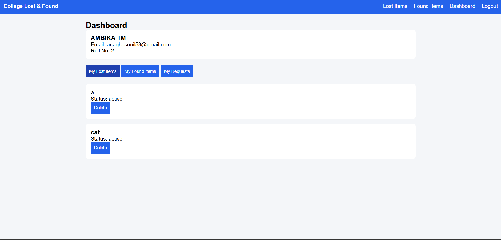
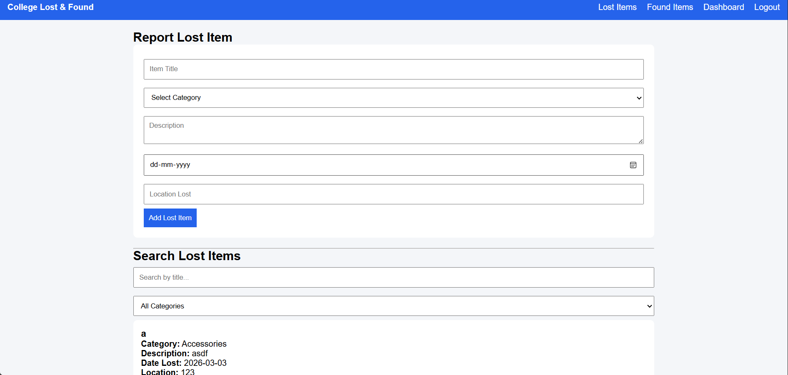
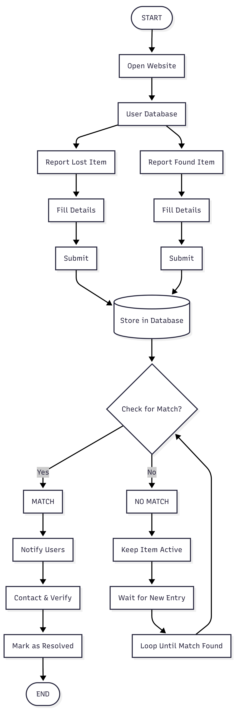

<p align="center">
  
</p>

# College Lost & Found Dashboard 🎯

---

## Basic Details

### Team Name
TINKTEAM

### Team Members
- Member 1: Anagha S Nair
- Member 2: Sneha D George

### Hosted Project Link

https://anaghasnair355.github.io/tinkherhack/

---

## Project Description

College Lost & Found Dashboard is a web-based application that enables students to report, manage, and track lost and found items within a college campus. Users can securely log in, post lost or found items, manage requests, and delete their own entries using Supabase backend services.

---

## The Problem Statement

Lost and found items in colleges are typically managed informally, making it difficult to track ownership, requests, and updates efficiently.

---

## The Solution

This project provides a centralized digital platform where authenticated users can:
- Post lost items
- Post found items
- Send and manage requests
- Securely delete their own items

Supabase handles authentication, database storage, and row-level security to ensure only owners can modify their data.

---

# Technical Details

## Technologies/Components Used

### For Software:
- Languages: HTML5, CSS3, JavaScript
- Frameworks: None (Vanilla JavaScript)
- Libraries: Supabase JS SDK v2
- Tools: VS Code, Git, Supabase, Browser DevTools

### For Hardware:
Not Applicable

---

# Features

- User Authentication (Login & Logout using Supabase)
- Personalized Dashboard displaying user information
- Separate Tabs:
  - My Lost Items
  - My Found Items
  - My Requests
- Delete functionality with Row-Level Security
- Accept/Reject system for found item requests
- Responsive card-based UI design

---

# Implementation

## For Software:

### Installation

```bash
git clone https://github.com/AnaghaSNair355/tinkherhack/
cd tinkherhack
```

### Configuration

Edit:

```
js/supabase.js
```

Replace with your Supabase credentials:

```javascript
import { createClient } from 'https://cdn.jsdelivr.net/npm/@supabase/supabase-js@2/dist/supabase.min.js';

export const supabase = createClient('_____________________________', '_____________________________');
```

### Run

Open `dashboard.html` in your browser.

---

## Project Documentation

### Screenshots (Add at least 3)


*Caption: LOGIN PAGE*


*Caption: DASHBOARD*


*Caption: LOST*

---

## Diagrams

### System Architecture



Our website has a frontend for users to report or view items, a backend server managing data and a database storing all lost and found records.  

---

### Application Workflow


User Reports Lost Item

User fills out a form with item details and contact info.

User Reports Found Item

Another user can report found items, including a photo and location.

Matching & Browsing

Users can search or filter through reported items to find matches.

Contact & Claim

Once a match is found, users can contact the other person via email or phone (through the website).

Update Status

After the item is claimed, the record is updated/removed from the list.

# Additional Documentation

## API Documentation

### Base URL

```
https://aaxfzkfelxsizhbtdofo.supabase.co
```

### Example Endpoints

#### GET /lost_items
Fetch logged-in user's lost items.

Headers:
```
apikey: sb_publishable_MQ7WTCYKKn_Na3sQNAcbhQ_CgPaj1_z
Authorization: Bearer https://aaxfzkfelxsizhbtdofo.supabase.co
```

---

#### DELETE /lost_items?id=eq.{id}

Deletes a lost item (RLS enforced).

---

#### GET /found_items

Fetch logged-in user's found items.

---

#### GET /requests

Fetch requests sent or received.

--- 

## Live Project
https://anaghasnair355.github.io/tinkherhack/

---

# Team Contributions
ANAGHA S NAIR: FRONT END
SNEHA D GEORGE:DATABASE

---

# License

This project is licensed under the _____________________________ License.

See the LICENSE file for details.

---

Made with ❤️ at TinkerHub
